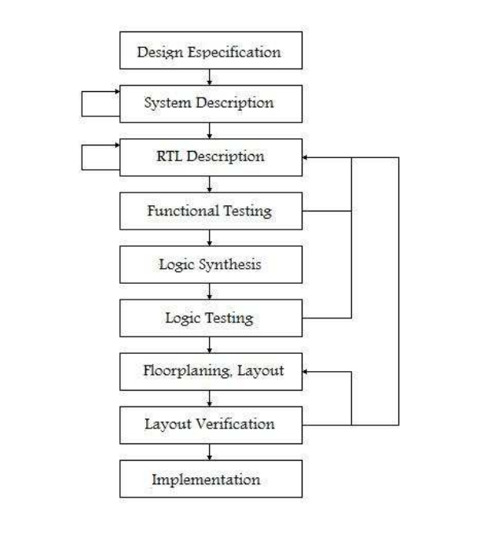
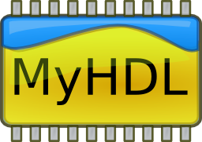
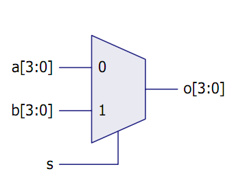

***************************
MyHDL, de Python al silicio
***************************

| por Martín Gaitán 
| 
| PyDay Córdoba 2011
| https://github.com/nqnwebs/myhdl-talk

El desafío
**********

.. class:: incremental

   * Gente que sabe de hardware pero no sabe Python (mis cumpas)
   * Gente que sabe de Python (mucho!) pero no de hardware
   * Yo, que sólo sé que no sé nada
   * En una charla de 25 minutos 

     .. image::  img/miedo.jpg
        :align: center
    
A modo de intro: Dónde estamos?
*******************************

.. class:: incremental

* ``programar HW != diseñar HW`` 
  
    * Hw con Funcionamiento y prestaciones predefinidas. 
    * Ejemplo: Arduino se programa sobre un uC que tiene un firmware.  
    * Desde el diseño el ASM es un lenguaje de "alto nivel"!

* Pero... ¿cómo se **diseña** un micro? 

    * Con ustedes los **HDL** (Hardware Description Language)
    * Electrónica digital a través software
    * VHDL y Verilog son los más típicos
    
Software? No era hardware?
**************************

.. class::  incremental

* FPGAs : Field **Programmable** Gates Array
  
  * Hardware "metaprogramable", 
  
  .. epigraph:: 

     El camaleón mamá,
     el camaleón,
     cambia de colores
     según la ocasión

     --  Chico Novarro

* Originalmente sólo para prototipar. 
    
    * Ahora son baratos, se usan en producción!
    
* >> escala, se fabrican chips `ASIC (Application-specific integrated circuit)`
    
    * con (casi) el mismo HDL!

La burocracia del Hardware
***************************

Un workflow más pythonico
***************************

Y qué corno es MyHDL ?
***********************

.. class::  incremental

  - Es un framework HDL en Python
  - Incluye tipos de datos, helpers, conversores y un simulador
  - Permite unificar algoritmo, RTL y verificación en un mismo entorno!  
  - Convierte (con ciertas restricciones) a VHDL o Verilog (sintetizable)
  - Permite cosimular Verilog  
  - Gratis
  - Libre (LGPL)
  

Un multiplexor en VHDL: The *hard* way
***************************************

::

    library ieee ;
    use ieee . std logic 1164 . all ;

    entity mux is
        port (
        a, b : in std logic vector (3 downto 0);
        s : in std logic ;
        o : out std logic vector (3 downto 0));
    end mux;
    architecture behavior of mux is
    begin  behavior
        o <= a when s = '0' else b;
    end behavior

- Requiere declarar la "entidad" (entradas y salidas)
- Tipado estático: requiere declarar tipo de entradas
- Verbósico y no muy ortogonal

Myhdl's way
***********

.. code-block:: python

   >>> "En IPython" # f12

- La entidad se determina por introspección (cuando se instancia)
- Python es dinámico ;-)
- *Simple is better than complex*!

Ok, pero explicalo
***********************

.. class:: incremental

   * "módulo" (bloque) de HW => función Python: ``mux`` 
   * En una función interna se define el comportamiento: ``logic``
   * Se decora con magia (``@always_comb``) y se vuelve un generador 
        
     .. class:: incremental

     * Los generadores guardan un **estado** interno
     * Esto permite la simulación
     * El decorador determina el tipo de sensibilidad. Predefinidos: 

       - ``@always_comb`` cuando cambie cualquier señal de entrada   
       - ``@always``: cuando cambie las que le indiquemos
       - ``@instance``: generador *adhoc* (se usa en testbench) 
    
    
Bueno, enchufemos!
******************

.. class:: incremental
 
   *  Y cómo echufamos? ``Signal`` (a.k.a "cablecitos")    

      .. code-block:: python
 
         >>> bus = Signal(0)
         >>> bus.val
         0
         >>> bus.next = 1
         >>>
      
   * Pero el HW tiene límites físicos ¿cuántos bits tiene ese bus?  

    .. code-block:: python
 
       >>> val = intbv(1, min=0, max=15)
       >>> len(val)
       4
       >>> bus = Signal(val)

Ahora sí, enchufemos!
*********************

- Hagamos un *testbench*

.. code-block:: python
 
    >>> codigo() #IPython

- y simulemos!

.. code-block:: python
 
   >>> !python ejemplo1.py #IPython
 
Se verifica con prints?
************************

- Un print sofisticado: generar formas de onda (*.vcd*) 

.. code-block:: python

    tb_4_sim = traceSignals(testBench)
    sim = Simulation(tb_4_sim)
    sim.run(20)

Veamoslo:

.. code-block:: bash

   gtkwave testBench.vcd

Pero mejor es hacer test de verdad!
***********************************

- ``unittest`` querido, el pueblo está contigo

.. code-block:: python

    >>> test() #Ipython

Convirtiendo pa'sintetizar
**************************

- A VHDL

.. code-block:: python

   mux_inst = toVHDL(mux, S, O, I0, I1) 

- A Verilog

.. code-block:: python

   mux_inst = toVerilog(mux, S, O, I0, I1) 
 
Conclusiones
************

.. class:: incremental

- MyHDL es una opción seria 

  - ... aunque su nombre no ayude a transmitirlo

- Algoritmia, RTL, simulación y test: Python FTW!
- La inferencia de patrones para conversion es pura magia
- Unittests (y TDD) : diseño de hardware ágil y bien
- Le debo mi última materia: hice un procesador MIPS en 3 semanas

    https://github.com/nqnwebs/pymips

Preguntas ?
************

.. code-block:: python

    for p in preguntas:
        try:
            responder(p)
        except NiPutaIdea:
            sonreir_y_hacerse_el_gil()

La hora referí
**************

- Gracias, y vamo' a comer

